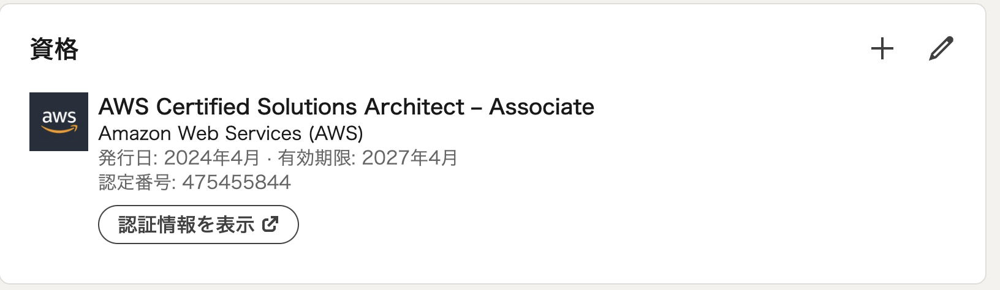

# はじめに

AWS 認定ソリューションアーキテクト アソシエイトに合格しました。他の人の受験記を参考にしたので私もせっかくだから少し書いていきます。
受験するきっかけは会社で認定試験のクーポンが配られるというところでした。今まであまり認定試験には興味がありませんでしたがある程度使っている AWS について改めて網羅的に理解を深めることができるのではないかと思い受験しました。

# 学習前の知識状況

 社会人としては今年で7年目。AWS については業務で触れており5年以上の経験がある状況です。

# 勉強方法について

AWSを業務で利用しているので問題集などは購入せず出題範囲を読み何回か問題を解き怪しい部分について整理していく、というような方法で進めました。
まず[試験ガイド](https://d1.awsstatic.com/ja_JP/training-and-certification/docs-sa-assoc/AWS-Certified-Solutions-Architect-Associate_Exam-Guide.pdf)を読んでみます。

はじめに試験の雰囲気を掴むために AWS 公式が提供している- [AWS Certificated Solutions Architect - Associate Official Practice Question Set (SAA-C03 - Japanese)](https://explore.skillbuilder.aws/learn/course/external/view/elearning/13269/aws-certified-solutions-architect-associate-official-practice-question-set-saa-c03-japanese?saa=sec&sec=prep)を解いてみます。さらにこれは問題数がそこまで多くないのでさらに[AWS認定資格Web問題集&徹底解説](https://aws-exam.net/saa/saa_question.php)も解いていきます。ここまでやってみると試験ガイドと読み合わせて自分の中で利用した事のないAWSサービスや暗記しないと行けなさそうな項目がある程度出てきます。私の場合は以下のような部分でした。

- EBS の IOPS について
    - EBS は種別によって最大IOPSが異なりこれの違いについての出題がある。
- セキュリティグループとネットワークACLの違い
    - ステートレスかステートフルか。
    - あまり意識したことがなかった。
- デフォルトの数
    - Elastic IP はすべてのAWSアカウントでリージョンあたり5つ
    - VPCは1リージョンあたり5つ
    - サブネットは1リージョンあたり200
- AWS Storage Gateway
    - ゲートウェイの種別がいくつかある
- [Amazon S3 のストレージクラス](https://aws.amazon.com/jp/s3/storage-classes/)について
    - Standard と Glacier
    - Standard の中にも IA や Onezone などがある。
    - Glacier にも3つ種類がありそれぞれ特徴な取り出し時間が異なる。

ここら辺までやり、8割方取れるようになりましたが不安になったのでさらに[Udamy 版 SAA-C03版　AWS 認定ソリューションアーキテクト アソシエイト試験問題集](https://www.udemy.com/course/aws-knan/?couponCode=ST6MT42324)の模擬試験を全て解きました。
これには難易度が高めの問題が出るようで中々7割を超えることができませんでしたが後半3題は合格点を超えることができるようになりました。これらを解くとさらに以下のような領域の知識が求められます。

- AWS IAM Identity Center 周り
- [S3 のオブジェクトロックにおけるモード](https://docs.aws.amazon.com/ja_jp/AmazonS3/latest/userguide/object-lock.html#object-lock-overview)
    - コンプライアンスモードとガバナンスモードという2つの保護レベルがあることを初めて知った。
- S3 の整合性とリクエストの制限について
    - S3 の整合性は結果整合性だったのが強整合になった。という話
        - [Amazon S3 アップデート – 強力な書き込み後の読み取り整合性](https://aws.amazon.com/jp/blogs/news/amazon-s3-update-strong-read-after-write-consistency/)
    - S3 バケットにオブジェクトを高速に追加したければ、プレフィックスを利用した日付ベースのアップロードによりリクエストを分散することで 3500リクエスト/秒、データ取得に関しては5500リクエスト/秒対応できるらしい。
        - 以前はハッシュ等を利用したランダムプレフィックスにする必要があったがこれも日付ベースでOKということに
- SQS と EventBridge の使い分け、違い
    - 何でもかんでも SQS でええやろと思いきや問題的には SQS だけでなく、EventBridge を組み合わせた方が最適という問題が結構ある。
- Amazon Polly や Amazon Comprehend などのマネージドサービス
- Amazon Kinesis Data Streams と Amazon Kinesis Data Firehose の違い
    - KDS は1秒以下のストリーミング処理
    - KFSは60秒間隔でデータ配信を行う
- EBS、AMI などのバックアップ、リカバリ手法
- オートスケーリングの設定

だいたい勉強期間としては試験日1週間前から始めたので合計でも20時間程度でした。またこのように自分のわからない知識をどこかにまとめておくと受験前に改めて確認することもできよかったです。

# 受験

受験場所に関しては受験会場はテストセンターを選びました。なぜなら、机の上をきれいにしたりするなど準備が大変な点や他の受験者や社内の評判的にもテストセンターで受けた方が快適だろうと判断してテストセンターにて受験しました。

試験日にはテストセンター最寄りの駅に30分前くらいにつき会場に、予定時刻の15分くらい前に入場しました。平日だったのもあり試験センターは空いておりスムーズに受付を終えました。
気をつけないといけないのは写真付き身分証明書を2つ持っていかなければならないということです。私は運転免許証とパスポートを持っていきました。
試験では試験官から利用するコンピュータまで案内されさらにホワイトボードのようなものを2つもらいました。これに関しては要望すればさらにもらえるようです。
ディスプレイは16インチくらいの正方形な形でかなりPCも古そうでしたが試験自体は問題なく動いていました。
そして模試を40分程度で解いていましたが流石に試験中は40分くらいで解いた後に見直しをし合計60分くらいで終え退出しました。

# 結果

結果としては合格でした。

<blockquote class="twitter-tweet">
AWS SAA ひとまず合格した <a href="https://t.co/jTM5gi5C13">pic.twitter.com/jTM5gi5C13</a>
&mdash; ryosan470 🍻 (@ryosan470) <a href="https://twitter.com/ryosan470/status/1785284307067843041?ref_src=twsrc%5Etfw">April 30, 2024</a></blockquote> 

823/1000 点で合格できました。かなり Udamy で解いた問題がそのまま出ていたので Udamy は全部やった方が初見問題みたいなものは結構減るかなというのが試験自体の感想です。

さらに Credly というサイトから合格のメッセージが来ました。このサイトに登録するとどうやら資格に合格した際にバッジがもらえるようです。

- [AWS Certificated Solutions Architect - Associate](https://www.credly.com/badges/01c5c08f-bbce-4675-aac7-a5770a14a940/public_url)

# 感想

ある程度AWSを利用していたとしても業務内容によってはほとんど知らない、またはあやふやな部分がいくつかあったので改めて試験対策を行うことで知識が整理できるのは非常に良かったです。
また、LinkedIn に試験合格後にバッジを掲載できるのも面白い点です。

またいくつかサービスの特性などが更新されている点も試験内容に反映されているので変化の激しいクラウド領域についてまとめて知識をアップデートするために受験するのはありかもなと感じました。
