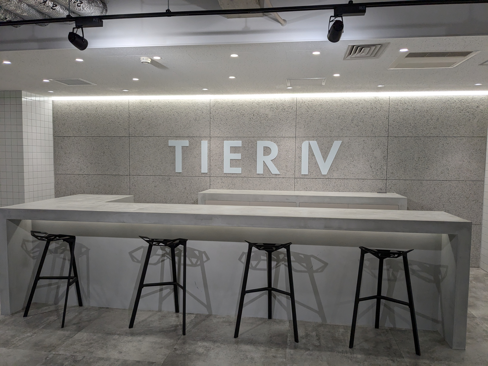

前職を退職して次なる新天地 TIER IV というスタートアップに入社しました。
入社自体は7月1日からで2ヶ月間の試用期間が終わったなうというような状況です。いまはクラウドチームというチームに所属しており、今まで通り Web バックエンドの領域の仕事を担当しています。

新しい環境に慣れるのは結構大変ですね。開発の仕方やコミュニケーションの取り方、会社の文化など、さまざまなことを学びキャッチアップする必要があり苦労も多いですが今までとは異なる新しい領域に関わることは楽しいです。もっぱら現在は Go 言語とドメイン駆動設計について慣れる必要があり学びながら吸収していっているところです。

これ以上書くネタが思いつかないのでこのくらいまでにしておきます。何か詳しいことを聞きたいなどありましたらお気軽にお知らせください。
