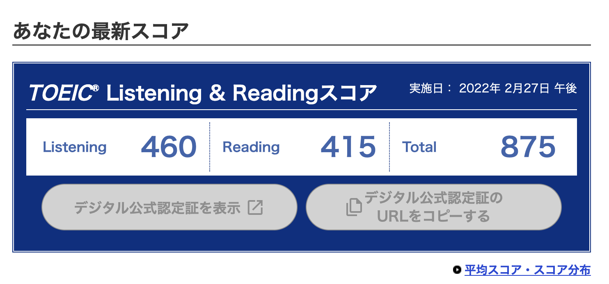

ここ最近、英語の学習を活発に行なっています。
自分が今までどのように英語と向き合い、今はどんな気持ちで学習しているのか現時点での状態を書き記し後世に思い出として残しておこうかと思います。

# 来歴

多くの日本人同様、私は日本で育ち英語というものに触れたのは中学生になってからです。
社会人になるまでの10年間は何か目的意識を持って学習するというより、試験勉強などやらないといけないから致し方なくなっているというような状況でした。
私も理系大学生の端くれではあったのである程度、英語の文法に関して勉強をしていましたが、正直穴だらけの知識で大学生の時に初めて受けたTOEICが550点程度でした。

社会人になり普通に日本企業に就職したので特に英語を使う機会もなく、1度、Google Cloud Next に参加するためサンフランシスコに行き、あとは海外旅行でオーストラリアとドイツに行ったくらいですが、どちらもしっかり英語を勉強していたわけではありません。

# きっかけ

コロナ禍になると引きこもり時間が増え、生産的なことをせず怠惰に引きこもる生活が始まりました。
何がきっかけだったかは忘れましたがこれではいけない、と思ったことや閉塞的な空気に嫌気がさし、将来は海外でソフトウェアエンジニアをやってみたいと思っていましたので、コロナ明けにオーストラリアやカナダ、イギリスなどにワーキングホリデーに行きつつ最終的には永住でもしてみようかと漠然と思うようになりました。

 # 目標作り

 とはいえどうすればいいのかわかりません。
 実はワーキングホリデーではそこまで英語の要件は厳しくありません。
 そこでソフトウェアエンジニアとしてビザを取得する要件を調べてみたところ、ものすごく高いわけではありませんが当時 (今の自分にとってもだが) の自分には到底超えられるような壁ではなかった気がします。
IELTS で Overall Score が 5.0 程度は必要なものでした。
当時の私は文法もちんぷんかんぷんでありこのままいきなり、IELTSに挑むにはハードルが高すぎます。また適当に海外の友達を作るなんてことは私にはできないですし、Cambly などを試す勇気はありませんでした。
そこでひとまず、リスニングとリーディングの知識をある程度つける勉強をしようとおもい、TOEIC で900点を取るという目標を立てました。

これが多分2021年の夏頃だったかと思います。

## TOEIC 対策

TOEIC はリスニングとリーディングの2部構成です。対策の詳細は専門的な記事等にお任せするとして私は主に 　[SANTA アルク](https://santa.alc.co.jp/) というアプリをやりこみました。

雑におすすめは

- リスニングパート
    - パート1をやりこんでからパート2に進む。
- リーディングパート
    - パート5の文法セクションをやりこむ。
    - パート7は短時間でいっぱい読む練習をする

という感じでしょうか。
およそ、半年間アプリをやりまくり、11月と翌年2月に TOEIC を受験し、900点は達成できませんでしたが、875点をマークしたところでこれ以上の挑戦はやめました。これ以上やってもあとはケアレスミスとの戦いだな。という感じしかなかったためです。

よく、TOEIC のハイスコアを取ったところで英語はできない、と言われますがそれは正解でもあり間違いでもあると思います。800点後半の私の能力は以下のような感じです。

- ある程度のスピードの英語であれば聞き取ることはできる。
    - 空港や駅でのアナウンスは聞き取り何を言っているのかわかるようになります。
- [BBC Learning English](https://www.bbc.co.uk/learningenglish/) もほぼ問題なく聞き取れる。
- BBC News などの英語ニュース系は聞き取れるがだんだんわからなくなる...
- 会話はまったくできない
- 英作文もまったくできない

こんな感じです。Listening & Reading しか対策していないので、会話や書き物ができないのは当たり前かもしれません。

## 発音対策

会話の練習をする前に今度は発音があまりにも日本語アクセントすぎるので、発音の練習をしています。
これは今もやっていますがなかなか向上していません。
みんながおすすめしている、[ELSA Speak アプリ](https://elsaspeak.com/ja/) の永久会員プランを購入してやっています。

## 英会話

2023年の夏頃に会社で英会話教室の助成をするのでやりたい人がいれば声をあげてくれ、という話があったのでそれに乗っかりました。

いまは、[GABAマンツーマン英会話](https://www.gaba.co.jp/)というレッスンを受けています。

はじめに、体験レッスンでGABA内での自分のレベルを判定してもらいます。私は Level 4 という判定を受け、これは中級 (下) というようなランクなようです。CEFRでいえば、A2 or B1 あたりでしょうか。

英会話レッスンを受けて初めてアウトプットの練習を行うようになりました。
週3、朝40分ほどのレッスンを受けており、様々なフレーズをインプットしアウトプットしています。
今では、

- 道案内、道をきく
- 電話応答
- 何か依頼をする
- 最近あったことなど

は少しずつ話せるようになってきました。ところが、時制や前置詞の使い分け、またさまざまな表現を知らないため、思っていることが話せない、出てこないなどのスキル不足な部分にも気づくことができました。

この記事執筆時点で40レッスンを受講したので、1600分 (26時間) 英会話レッスンを受けることができました。CEFRレベルを1つあげるのに200時間必要と言われているらしいのでまだまだ遠い道のりだなぁとは思いつつも少しずつ自分の成長を感じることができています。

実は最近、GABAマンツーマンレッスンのレベルアップ判定 (LPA) というものを受けたのですが惜しくも合格にはならず現状のレベルのままさらに研鑽を励めということになりました。まだまだ学習を続けていかねば...という感じですが引き続きやっていきます。

# まとめ

2024年1月末時点でまだまだ英語の能力はダメダメ...

ここ最近は ChatGPT に英作文を書き添削をしてもらっているのでその辺のスクリプトの例の紹介や、GABAマンツーマン英会話のLPAのお話でも今後かければいいかなと思いつつ頑張りたい。
