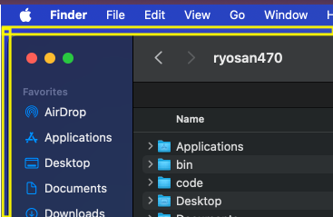
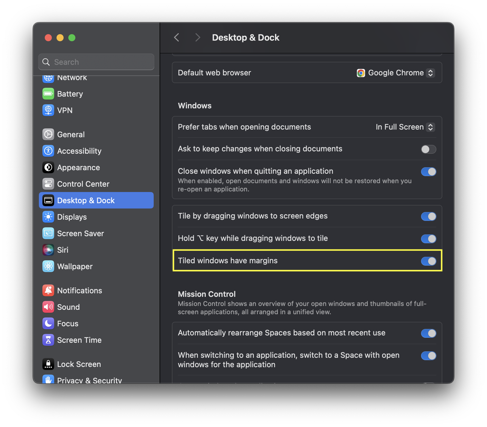
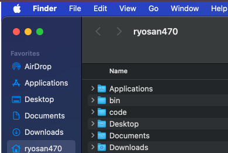

macOS 15.0 Sequoia にアップデートしたところ、ウィンドウに余白ができるようになりました。

(この黄色く囲った部分が macOS 15.0 にアップデートしたときに発生した余白です)

さて、元々ウィンドウ内でアプリケーションのウィンドウを半分にしたりなど Windows ライクの操作を実現するために BetterTouch Tool というアプリケーションを使用しており、これが最新 OS になってバグっているのかなぁと放置しておりましたが数週間経っても治らないのでどうやら違うようです。

そういうわけでもう少し深掘りしてみると、macOS 15.0 から [Mac でウィンドウをタイル表示する](https://support.apple.com/ja-jp/guide/mac-help/mchlef287e5d/15.0/mac/15.0) ことができるようになったようです。

macOS の設定で、Desktop & Dock の項目の中の Windows の項目の中に *Tiled windows have margins* という項目がありこれをオフにすれば余計な余白がなくなり、ウィンドウいっぱいにアプリケーションが詰め込まれるようになりました。

これで余白がなくなり、ウィンドウ目一杯にアプリケーションを表示することができるようになりました。

めでたしめでたし。
