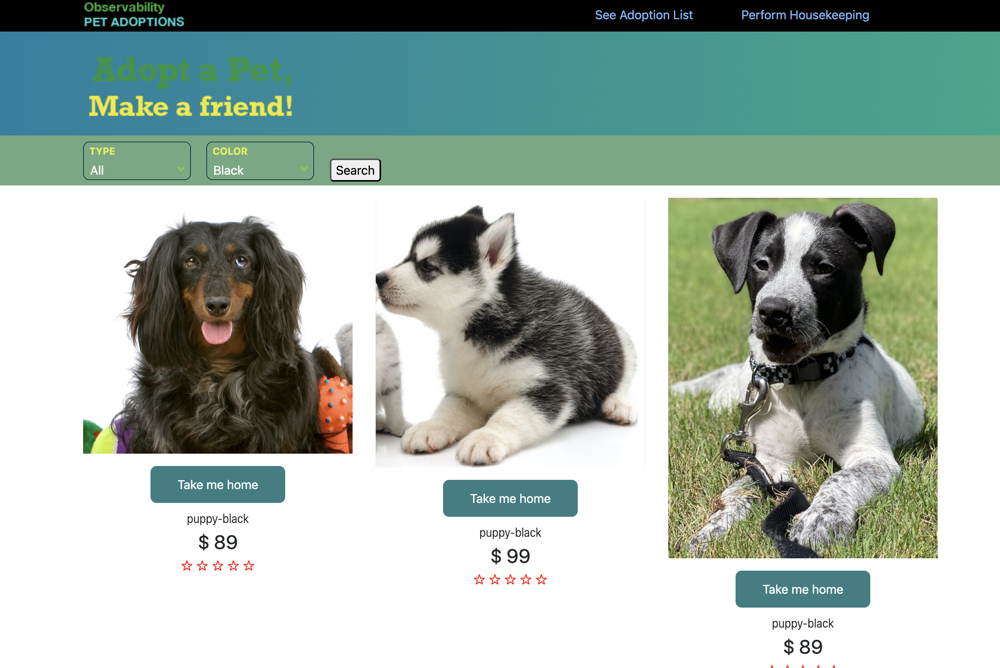
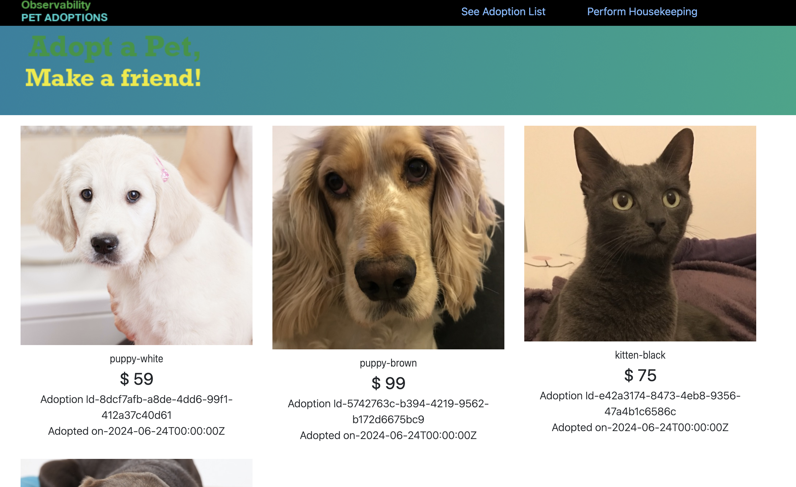
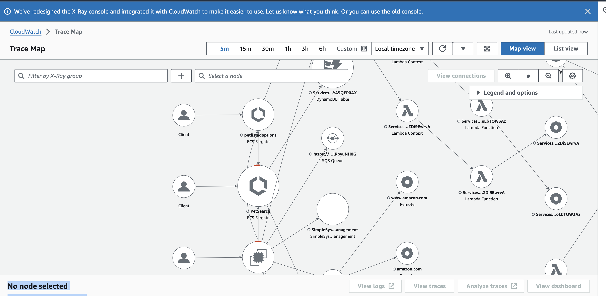
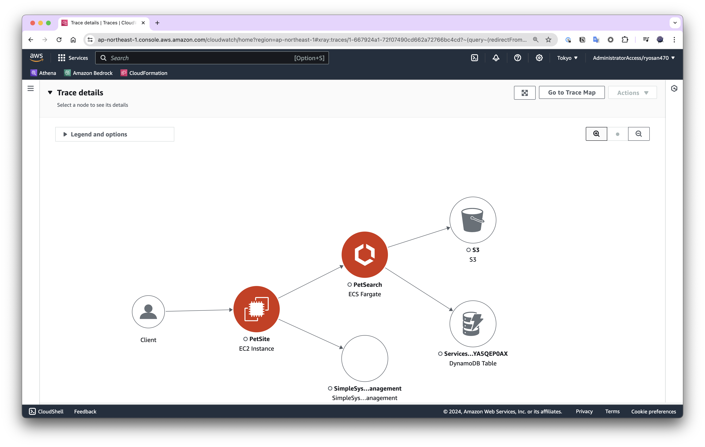
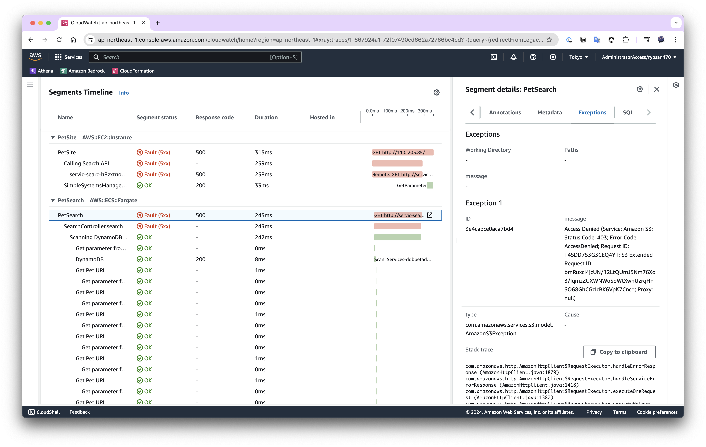

先日は AWS Amplify Gen2 のワークショップに取り組んでいましたが今日からはさらに別のワークショップとして [Observability のワークショップ](https://catalog.us-east-1.prod.workshops.aws/workshops/31676d37-bbe9-4992-9cd1-ceae13c5116c/ja-JP/intro#aws-observability) に取り組んでみます。このワークショップは日本語で書かれているので取り組みやすいですね。

# はじめに

さて今回も前回同様[自分の AWS アカウントを利用](https://catalog.us-east-1.prod.workshops.aws/workshops/31676d37-bbe9-4992-9cd1-ceae13c5116c/ja-JP/installation)してワークショップを進めていきます。

実は初めに Cloud9 を利用しない方向で進めていたのですが、Macbook Air (M1 2020) ではイメージのビルドあたりで先に進めなくなってしまったので大人しく Cloud9 を使うようにしました。

```console
AWSReservedSSO_AdministratorAccess_daa2d0b4e715509f:~/environment/one-observability-demo/PetAdoptions/cdk (main) $ cdk bootstrap aws://${ACCOUNT_ID}/${AWS_REGION}
 ⏳  Bootstrapping environment aws://645756205742/ap-northeast-1...
Trusted accounts for deployment: (none)
Trusted accounts for lookup: (none)
Using default execution policy of 'arn:aws:iam::aws:policy/AdministratorAccess'. Pass '--cloudformation-execution-policies' to customize.
 ✅  Environment aws://645756205742/ap-northeast-1 bootstrapped (no changes).

AWSReservedSSO_AdministratorAccess_daa2d0b4e715509f:~/environment/one-observability-demo/PetAdoptions/cdk (main) $
```

こんな感じで CDK のブートストラップを進めます。次にデプロイをするのですが Cloud9 のデフォルトのディスク容量 (10GB) では容量不足となるので EBS を 50GB に更新してから行います。ディスクの拡張方法については [Amazon EBS のドキュメント](https://docs.aws.amazon.com/ebs/latest/userguide/recognize-expanded-volume-linux.html?icmpid=docs_ec2_console)を参照して対応してください。

ディスクが増えれば問題なく先に進むことができました。あとはデプロイをしていきます。

```console
% kubectl get nodes

NAME                                              STATUS   ROLES    AGE   VERSION
ip-11-0-174-31.ap-northeast-1.compute.internal    Ready    <none>   10m   v1.28.8-eks-ae9a62a
ip-11-0-221-213.ap-northeast-1.compute.internal   Ready    <none>   10m   v1.28.8-eks-ae9a62a
```

ここまでくるのに紆余曲折あり 2 時間ほどかかりました 😭

# アプリケーションアーキテクチャ


アーキテクチャ図を見てみると、大きく 4 つの要素に分かれたマイクロサービスアーキテクチャのようになっているようですね。このアプリケーションではペットを探しお家に連れ帰ることのできるサービスのようで引き取るときにお金を支払う必要があるようです。

## フロントエンドサービス

ユーザーが一番最初にアクセスするフロントエンドサービスは C# で構築されています。ソースコードは [petsite](https://github.com/aws-samples/one-observability-demo/tree/main/PetAdoptions/petsite/petsite) にあります。

## 検索サービス

検索サービスは Java となっており、ソースコードは [petsearch-java](https://github.com/aws-samples/one-observability-demo/tree/main/PetAdoptions/petsearch-java) にあります。ペットの色や種別を絞ることができます。



## ペット一覧

ペットの一覧を返す API サービスは Golang で書かれており、ソースコードは [petlistadoptions-go](https://github.com/aws-samples/one-observability-demo/tree/main/PetAdoptions/petlistadoptions-go) にあります。ざっくり読んでみる限りこの API は読み込みのみの対応のようです。

## ペット引取り一覧

引き取ったペットたちの一覧を確認することのできる API で Python で書かれておりソースコードは [petadoptionshistory-py](https://github.com/aws-samples/one-observability-demo/tree/main/PetAdoptions/petadoptionshistory-py) にあります。この API も基本的には読み込みのみ行います。



## 支払い

ペットを引き取るには金額が決まっておりカードを用いて決済を行います。このときのサービスが支払いサービスで [PayForAdoptionsAPI](https://github.com/aws-samples/one-observability-demo/tree/main/PetAdoptions/payforadoption-go) にコードがあります。ここで購入に成功すると Adoption History 等が更新されるようです。

## 他

そのほかにも Lambda 関数で何かが動いているようですが一旦は割愛していきます。

# AWS ネイティブ Observability

CloudWatch と X-Ray について機能を確認できるようです。CloudWatch については私自身経験があるので軽く進めていきます。

## Log

### Logs Insight

`dedup` というクエリについては知らなかったので勉強になりました。重複排除を行えば大量に出力される同じメッセージのログを落とし 1 件だけ表示することができるようになります。さらに自然言語でも一部リージョンでクエリを行うことができるようになっているようです。(残念ながら東京リージョンではまだ利用できない模様)

### ログの異常検知

異常検知機能については使ったことがなかったので早速触れてみます。

[前の期間とパターンを比較する](https://catalog.us-east-1.prod.workshops.aws/workshops/31676d37-bbe9-4992-9cd1-ceae13c5116c/ja-JP/aws-native/logs/loganomaly/compare)ことでログイベントの変化を追うことができるのは非常に便利ですね。

# X-Ray



X-Ray のトレースマップを開いてみました。

トレース ID をクリックすると色々なことが詳しく確認できます。



このように図解されるのでどのサービスがどう関わっているのかパッと理解できるのは良いですね。さらに下部にはセグメントごとのタイムラインもありどこでエラーになっているかなどが確認できます。



# アプリケーションモニタリング
