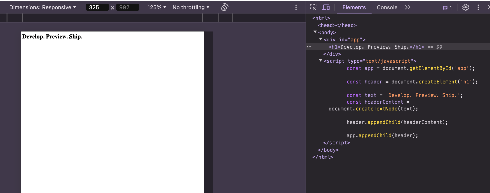
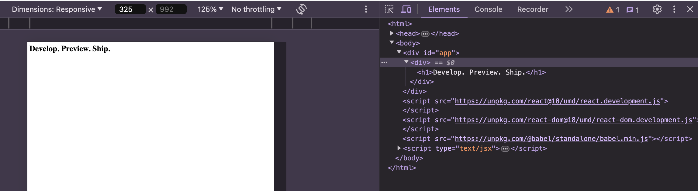

[株式会社 MIXI を退職しました]() にあるように退職したおかげで 1 ヶ月弱の有休消化期間ができました。私にとってフロントエンド技術に関しては疎くいい加減この苦手意識を根絶したくフロントエンド技術について学び直します。

せっかくなので何かモダンなフレームワークを学んでみたいなということで Next.js の理解を進めてみようかと思います。

本記事は私のための学習記録を残しておく目的で執筆しています。半分日記のようなものだと思っていただければ幸いです。

# はじめに

改めて基礎知識を学び直すことにしました。調べてみると [Frondend Developer Roadmap](https://roadmap.sh/frontend) というサイトを見かけました。

このサイトを見つつ怪しい場所を見返してみます。

- HTML
- CSS
- JavaScript
  - DOM

# React のチュートリアルを進める

さてある程度基礎を理解しなおしたところで、Next.js のチュートリアルを進めてみようかなと思ったのですが、いきなり Next.js を理解するのではなく、React のチュートリアルが提供されておりそちらを理解してから進めた方が良いそうです。そんなわけで早速そっちを進めてみます。以下には自分で読み進めたところのうちいくつかのメモを記録しておきます。

## [1. About React and Next.js](https://nextjs.org/learn/react-foundations/what-is-react-and-nextjs)

- Next.js は React のフレームワーク
  - UI の構築には React を利用している。
- React は インタラクティブユーザーインターフェースを構築するための JavaScript のライブラリ。

## [2. Rendering UI](https://nextjs.org/learn/react-foundations/rendering-ui)

まずはじめにユーザーが Web サイトに訪れたとき、どのようなことが起きているかが書かれています。ざっくり、サーバーは HTML を返却しブラウザーがそれを読み込み、DOM (Document Object Model) を組み立てます。DOM は木構造になっており、親子関係を表現しています。

## [3. Updating UI with JavaScript](https://nextjs.org/learn/react-foundations/updating-ui-with-javascript)

JavaScript と DOM メソッドを利用して `h1` タグを追加する仕方を学びます。

今まで理解していなかったのですが、ブラウザの開発者ツールで見える要素の表示は DOM で DOM は JavaScript を実行して生成されたものを示すんですね。

そしてこの JavaScript の例は _命令型プログラミング_ の例を示しているが、これは煩雑で _宣言的なアプローチ_ の方が便利では？ということになったため、React は有名な宣言型のライブラリなんですね。

## [4. Getting Started with React](https://nextjs.org/learn/react-foundations/getting-started-with-react)

- _react_ は React のコアライブラリ
- _react-dom_ は DOM を React で使用できるようにする DOM 固有のメソッドを提供している。

さて、`ReactDOM.createRoot()` と `render` 関数を用いて生の JavaScript を使わずに書き直しましたが急に Babel と JSX なる物体が出てきました。

### JSX とは

- JavaScript の拡張構文で _HTML_ のような文法で UI を記述できる。
- [3 つの JSX のルール](https://react.dev/learn/writing-markup-with-jsx#the-rules-of-jsx) に従う必要がある
- ただし、JSX をブラウザーは理解できないので Babel 等を使ってコンパイルする必要がある

## [5. Building UI with Components](https://nextjs.org/learn/react-foundations/building-ui-with-components)

React における 3 つの中心的な概念を理解しておく必要があるとのこと。

- Components
- Props
- State

### Components

コンポーネントは UI を分割したときの最小？単位のことで、わかりやすく言えば、_レゴブロック_ のようなもので組み合わせたりすることで大きなものを作り上げることができると書いてあります。

- React コンポーネントは生の HTML や JavaScript と区別するために大文字で始める必要がある。
- 通常の HTML タグを使用するのと同じく、`<>` を使用して React コンポーネントを利用する。

コンポーネントはネストできるとのことでやってみて、ブラウザの開発者ツールで確認してみました。

いい感じですね。

# おわりに

今日はこの辺で終わります。続きを執筆したらリンクを追加します。本日は約 1.5 時間で基礎的なフロントエンド技術の基礎と React のチュートリアルを少しやりました。JavaScript もあまり詳しくないので進めていく上で必要になれば勉強を追加でしていきたいと思います。

次: [2024 年のフロントエンド技術学び直し (2)]()
