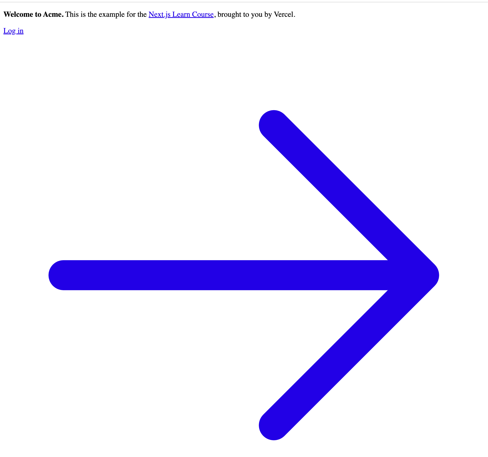
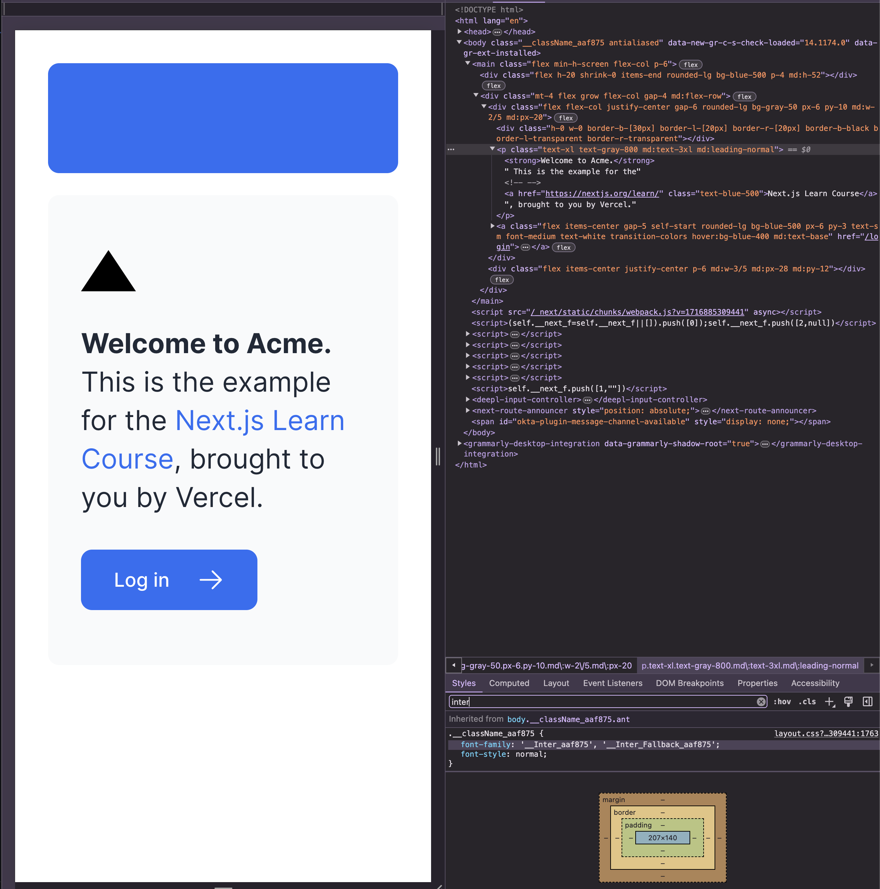
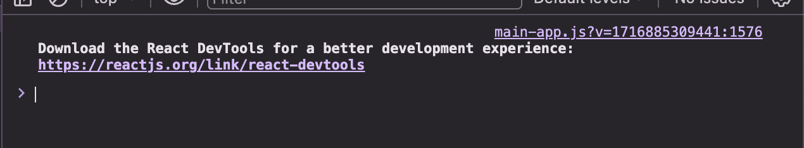
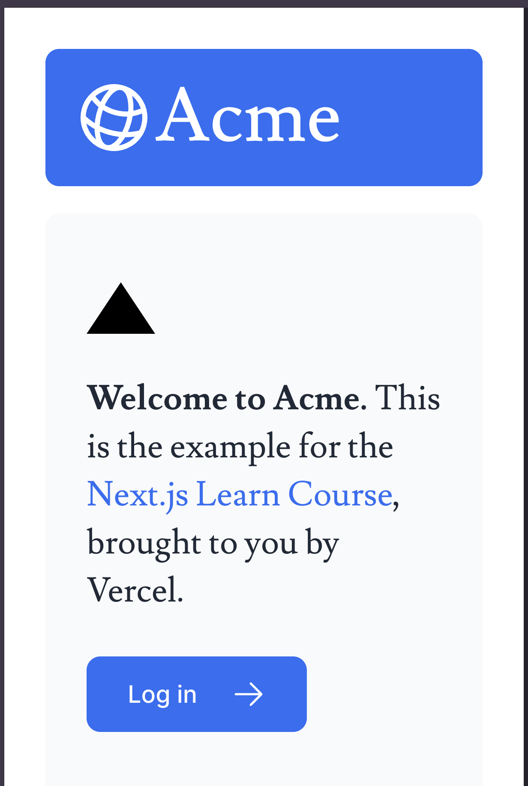
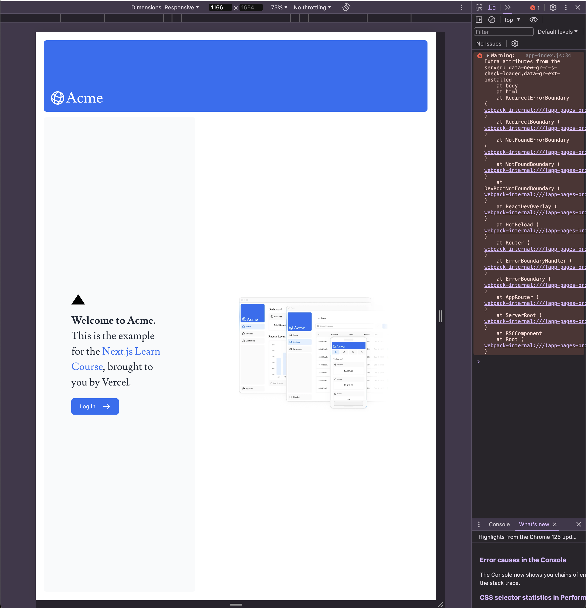
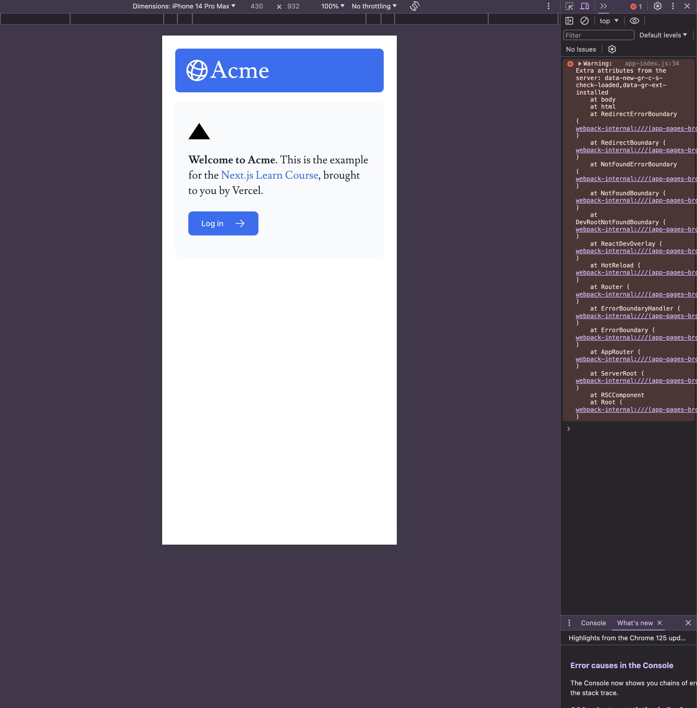

前回は [2024 年のフロントエンド技術学び直し (2)]() にて React のチュートリアルを完了しました。今回は Next.js のチュートリアルを進めていきたいと思います。

# Next.js のチュートリアル

Next.js の公式ドキュメントにある [Learn Next.js](https://nextjs.org/learn/dashboard-app) を進めていきます。どうやらこのチュートリアルではいくつかの機能を持つ簡単な財務ダッシュボードを作っていくようです。

React に関しては前回と前々回で学んできたので一応基礎知識については持ち合わせているつもりです。ただわからなくなれば React 等のリソースにあたっていこうかと思います。

## [1. Getting Started](https://nextjs.org/learn/dashboard-app/getting-started)

特にいうことはありません。書いてある通りに進めると、http://localhost:3000 にアクセスできるようになります。

## [2. CSS Styling](https://nextjs.org/learn/dashboard-app/css-styling)

グローバルに適用される CSS ルールは root レイアウトにインポートしましょう。という話。チュートリアル通りに追記をするとトップページの UI がちょっとマシになりました。

### Tailwind

Tailwind は名前を聞いたこともありましたし、仕事で見かけたりもしましたが何なのかはよくわかっていませんでした。ざっくりいうと CSS のフレームワークなんですね。

チュートリアルのコードをコピペすると次のようになりました。

### CSS Modules

> Create locally scoped CSS classes to avoid naming conflicts and improve maintainability.

と書かれていたので、グローバルではなく一部のファイル等で CSS スタイリングを変更したいときにモジュール化できますよってことなんだろうか。ちょっとまだ理解できていません。

### `clsx` ライブラリを使う

要素の状態や他の条件でスタイルを変更したいときに、`clsx` というライブラリを使えばいいらしいですね。

## [3. Optimizing Fonts and Images](https://nextjs.org/learn/dashboard-app/optimizing-fonts-images)

フォントと画像の取り扱いとその最適化についての章ですね。Next.js では `next/font` モジュールを使えばアプリケーション内でのフォントの最適化を行なってくれると書いてあるのでパフォーマンスを向上してくれるようです。

開発者ツールで確認してみると、`Inter` と `Inter_Fallback` という文字が見えました。

---

この時点で開発者ツールを開いてみたときに、Console に次のような文字が出ていることに気づきました。

せっかくなのでこれの言うことを聞いて、インストールしてみます。

インストールしてみましたが特に何も出てきませんでした 😇

原因はわからないので一旦はみなかったことにしてチュートリアルを継続します。

---

### 練習: セカンダリーフォントを追加する

そんなに難しいことはせずに追加できました。便利ですね。

### 画像の最適化

`<Image>` というコンポーネントは HTML の `` タグの拡張で自動的に画像の最適化をしてくれると書いてあります。

- 画像読み込み時に自動的にレイアウトのずれを防止する
- 小さな画面を持つデバイスに大きな画像が配信されないようにするために画像のサイズを変更する
- 画像の読み込みをデフォルトで遅延する
- ブラウザーがサポートしていれば、WebP や AVIF のようなモダンなフォーマットで画像を配信する

これらを自動でやってくれるのはめちゃくちゃ便利ですね。チュートリアルに従いそのまま `<Image>` コンポーネントを使ってみます。

注釈に書いてある通り、デスクトップ表示では画像が表示されるのに対し、モバイルデバイスでは画像が大きすぎてバランスが崩れるので非表示になることが確認できました。

最後に練習を解いてみます。同じように今度はモバイルデバイス用の画像を `<Image>` コンポーネントを使って表示するようにすれば良いようですね。

`Image` コンポーネントの `className` に何を書けば良いのかわからず答えを見てしまいました。これはどこでわかるようになるんでしょうかね。
