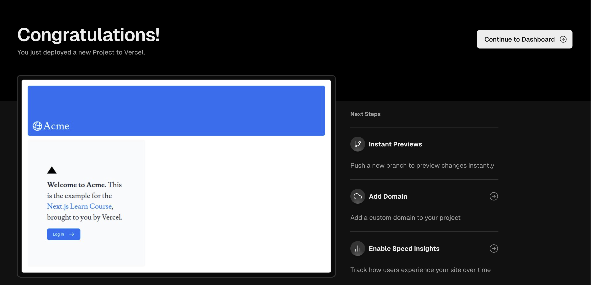
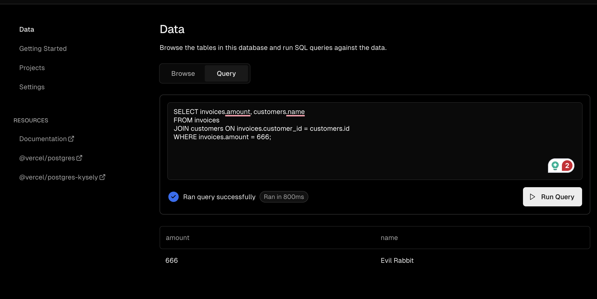
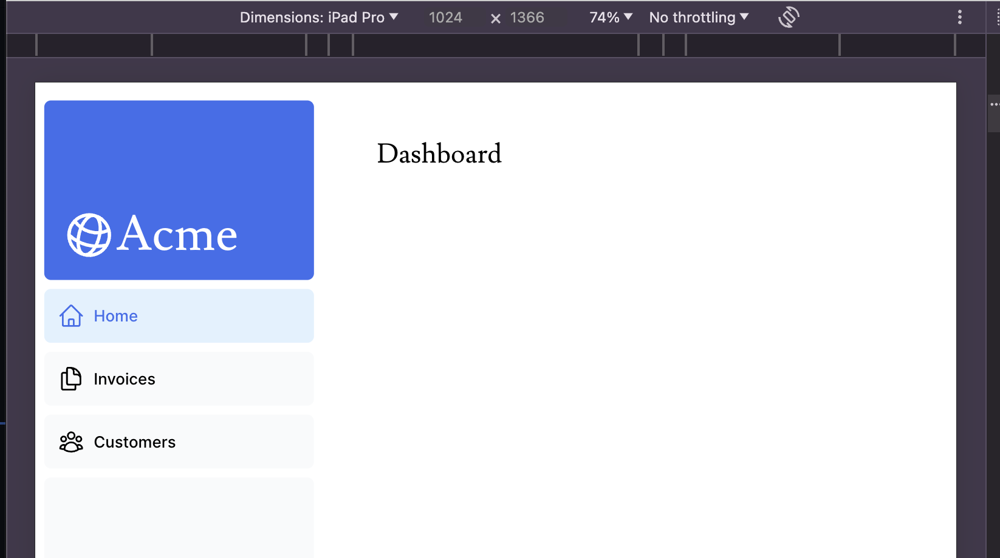
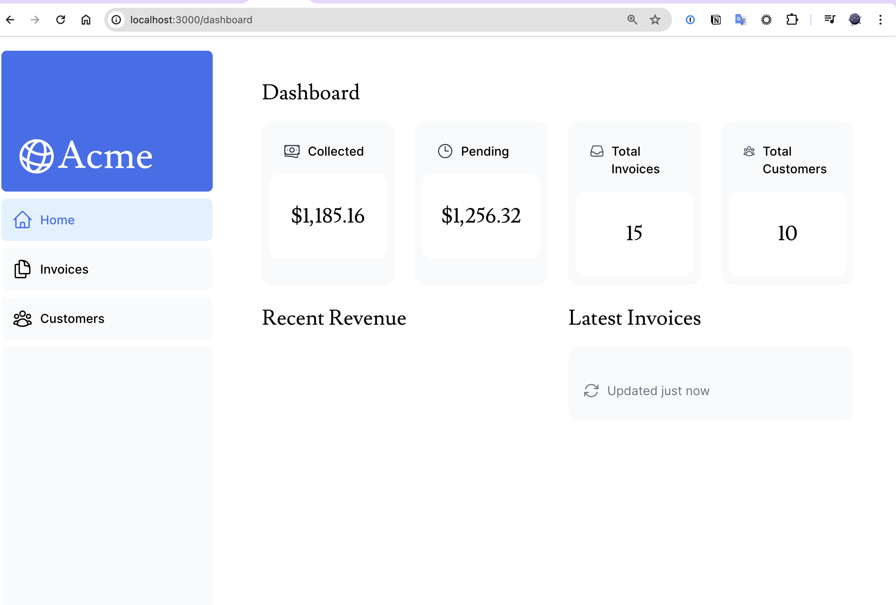

前回は [2024 年のフロントエンド技術学び直し (3)]() にて Next.js のチュートリアルのうち、3 章まで終わりました。本日は 4 章から進めていきます。

## [4. Creating Layouts and Pages](https://nextjs.org/learn/dashboard-app/creating-layouts-and-pages)

Next.js はファイルシステムルーティングを使用していると書かれています。

- `page.tsx` は React コンポーネントをエクスポートする特別な Next.js のファイル
  - ネストされたルーティングを作る場合はフォルダの配下に `page.tsx` を作れば良い。

チュートリアルでは、`app/dashboard` と言うディレクトリを作成しそこの中に `page.tsx` を作ることで新たにネスティングされているルートを作成します。

すごいシンプルですね。同様に練習で dashboard 以下に customers と invoices ページを作成していきます。以下のようなディレクトリ、ファイル構成になりました。

```console
% tree app/dashboard
app/dashboard
├── customers
│   └── page.tsx
├── invoices
│   └── page.tsx
└── page.tsx
```

次にダッシュボードのレイアウトを定義するために `layout.tsx` と言うファイルを `app/dashboard` 配下に作成します。サイドバーを作成するようですね。いい感じにサイドバーができました。


## [5. Navigating Between Pages](https://nextjs.org/learn/dashboard-app/navigating-between-pages)

この章では前章で作成したダッシュボードのサイドバーに `next/link` コンポーネントを使ってリンクを張る方法を学ぶことができるようですね。そのために Next.js には [`<Link />` というコンポーネント](https://nextjs.org/docs/app/api-reference/components/link)が用意されており、これは HTML の `<a>` タグを置き換えるもののようですね。

チュートリアルの例ではただ、`<a>` タグを `<Link>` に置き換えただけでした。正直これで何が嬉しいのと言う気持ちになりましたがよく読んでみると、`<Link>` タグが表示されると Next.js が裏でそのリンク先も先にフェッチしておいてくれるようですね。そうすることでユーザーが実際にリンクを踏んだときのロードが爆速になると。よく考えられていますね。

---

自分が現在どこのリンクにいるかを把握するためにクライアントコンポーネントに含まれる [`usePathname()`](https://nextjs.org/docs/app/api-reference/functions/use-pathname) というフックを使うことでわかるようです。これは React のクライアントコンポーネントなのでファイルの先頭に `"use client"` と書く必要があります。[^1]

[^1]: [2024 年のフロントエンド技術学び直し (2)]() で学んだ内容だった。

チュートリアルのコードをそのままコピペしてやると以下のように選択した場所が薄い青色で塗りつぶされます。


## [6. Setting Up Your Database](https://nextjs.org/learn/dashboard-app/setting-up-your-database)

ここから急に毛色が変わって、PostgreSQL の設定を行うようです。ひとまず [GitHub リポジトリ](https://github.com/ryosan-470/nextjs-dashboard)を作成しました。さらに Vercel のアカウントと紐付けてデプロイすると以下のような画面になりました。



次に PostgreSQL のデータベースを作成します。どうやらこれも Vercel が提供しているようです。[Pricing のページ](https://vercel.com/pricing)を見る限り、60 compute hours 分は Hobby アカウントに含まれているようです。また、[Compute Time の計算方法](https://vercel.com/docs/storage/vercel-postgres/usage-and-pricing#compute-time) についても公式ドキュメントに記載がありますが、デプロイしただけでは課金されず実際に DB が CPU によって処理をしているときのみ課金されるようです。

ひとまず作成し認証情報を取得した後にデータベースに初期データを投入します。
次に投入したデータを確認するために Vercel のダッシュボードに戻り SQL を入力します。



便利ですね〜

## [7. Fetching Data](https://nextjs.org/learn/dashboard-app/fetching-data)

「データの取得」とあるように API や ORM ORM、SQL などを利用してデータを取得する方法について学べるようです。フロントエンドなら普通 API 一択なのでは？と思ったのですが、React Server Component (RSC) を利用していれば API を作る必要なく直接データベースにクエリを行えるというわけなんですね。

そして今回は ORM ではなく Vercel Postgres SDK を使って直接 SQL を書いていくようです。すでに `/app/lib/data.ts` の中にデータベースからデータを取得する関数が定義されているのでそれを使っていくようです。

ひとまずコメントアウト以外を書いてみたところ表示は以下のようになりました。



さて、この後に `data.ts` に含まれる関数を用いてデータを実際に取得しレンダリングすると以下のようになりました。



表示はされるようになりましたが、Recent Revenue と Latest Invoices は何も表示されていませんね。

### データフェッチ: ウォーターフォール

簡単に言えば前から順番にデータを取得すると言う仕組みのようですね。何か前条件があって次のデータを取得すると言う場合は有用そうですが遅くなりそうです。そんなわけでウォーターフォールを避ける仕組みとして JavaScript にある `Promise.all()` や `Promise.allSettled()` 関数を使って初期データを同時に取得できる仕組みがあるようです。

# まとめ

本日は Next.js のチュートリアルを進め、レイアウトや新規ページの作り方やデータフェッチの方法を学びました。また、Vercel アカウントを作りデプロイしてみて Vercel の使い心地も把握できました。また引き続き進めていきたいと思います。
