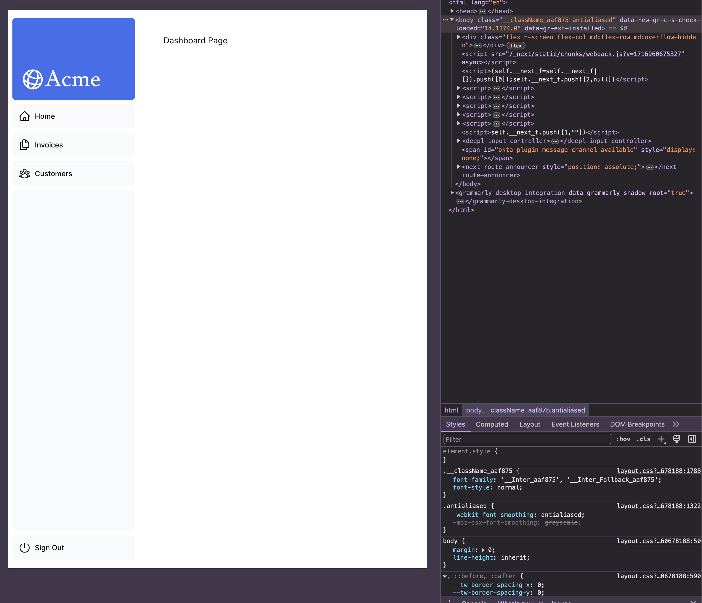
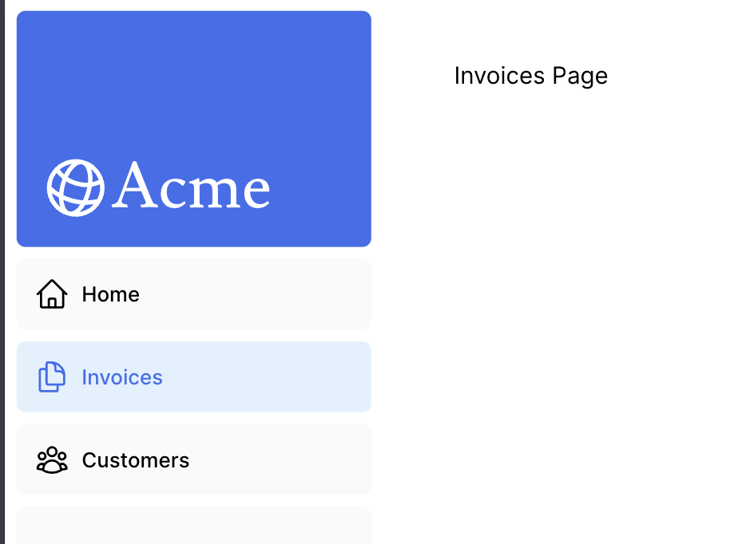

前回は [2024 年のフロントエンド技術学び直し (3)]() にて Next.js のチュートリアルのうち、3 章まで終わりました。本日は 4 章から進めていきます。

## [4. Creating Layouts and Pages](https://nextjs.org/learn/dashboard-app/creating-layouts-and-pages)

Next.js はファイルシステムルーティングを使用していると書かれています。

- `page.tsx` は React コンポーネントをエクスポートする特別な Next.js のファイル
  - ネストされたルーティングを作る場合はフォルダの配下に `page.tsx` を作れば良い。

チュートリアルでは、`app/dashboard` と言うディレクトリを作成しそこの中に `page.tsx` を作ることで新たにネスティングされているルートを作成します。

すごいシンプルですね。同様に練習で dashboard 以下に customers と invoices ページを作成していきます。以下のようなディレクトリ、ファイル構成になりました。

```console
% tree app/dashboard
app/dashboard
├── customers
│   └── page.tsx
├── invoices
│   └── page.tsx
└── page.tsx
```

次にダッシュボードのレイアウトを定義するために `layout.tsx` と言うファイルを `app/dashboard` 配下に作成します。サイドバーを作成するようですね。いい感じにサイドバーができました。



## [5. Navigating Between Pages](https://nextjs.org/learn/dashboard-app/navigating-between-pages)

この章では前章で作成したダッシュボードのサイドバーに `next/link` コンポーネントを使ってリンクを張る方法を学ぶことができるようですね。そのために Next.js には [`<Link />` というコンポーネント](https://nextjs.org/docs/app/api-reference/components/link)が用意されており、これは HTML の `<a>` タグを置き換えるもののようですね。

チュートリアルの例ではただ、`<a>` タグを `<Link>` に置き換えただけでした。正直これで何が嬉しいのと言う気持ちになりましたがよく読んでみると、`<Link>` タグが表示されると Next.js が裏でそのリンク先も先にフェッチしておいてくれるようですね。そうすることでユーザーが実際にリンクを踏んだときのロードが爆速になると。よく考えられていますね。

---

自分が現在どこのリンクにいるかを把握するためにクライアントコンポーネントに含まれる [`usePathname()`](https://nextjs.org/docs/app/api-reference/functions/use-pathname) というフックを使うことでわかるようです。これは React のクライアントコンポーネントなのでファイルの先頭に `"use client"` と書く必要があります。[^1]

[^1]: [2024 年のフロントエンド技術学び直し (2)]() で学んだ内容だった。

チュートリアルのコードをそのままコピペしてやると以下のように選択した場所が薄い青色で塗りつぶされます。


