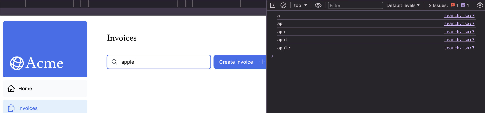
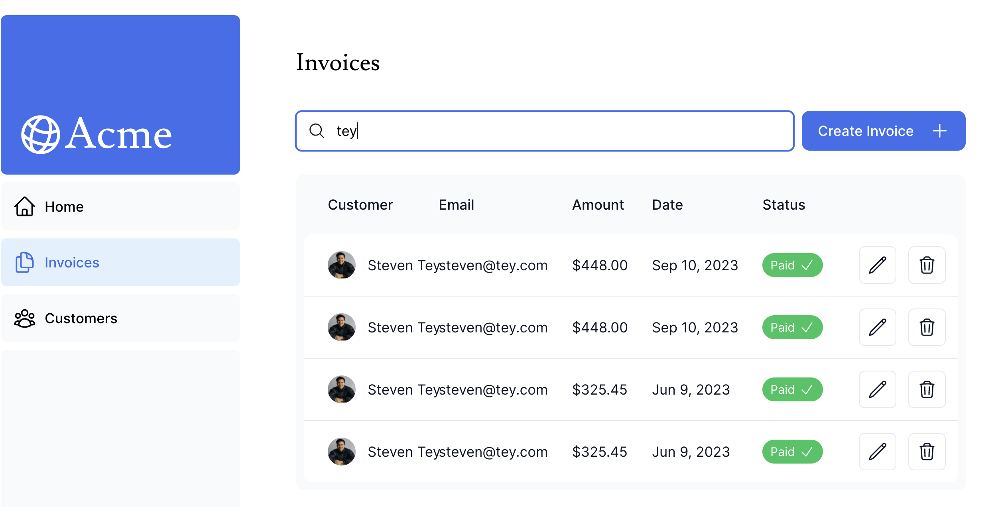
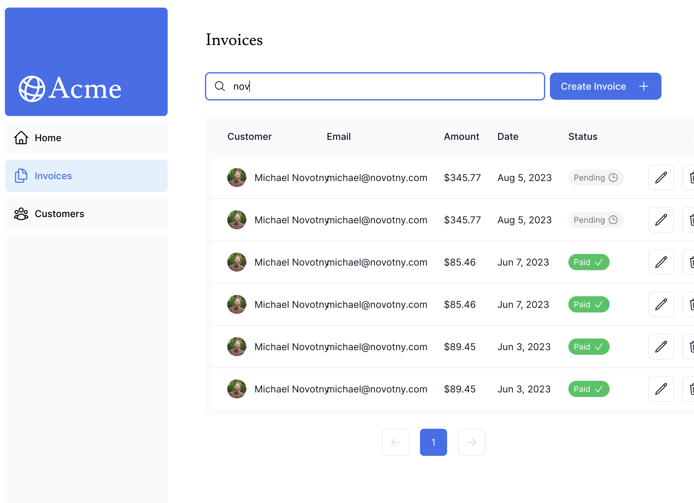
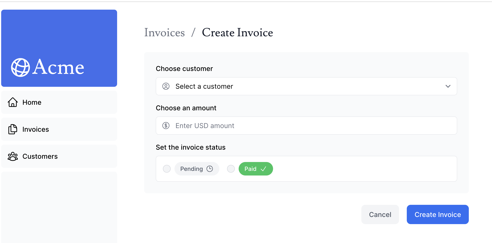

前回は [2024 年のフロントエンド技術学び直し (5)]() にて Next.js のチュートリアルのうち、10 章まで終わりました。本日は 11 章から進めていきます。

## [11. Adding Search and Pagination](https://nextjs.org/learn/dashboard-app/adding-search-and-pagination)

`/invoices` ページに検索とページネーションを追加していくようです。読んでいくとどうやら、検索パラメータは URL にそのまま埋め込むようです。こうすることでユーザーが結果をブックマークしたり URL 自体を共有することもでき、さらにサーバーサイドレンダリングによりこれらをキャッシュしたり解析と追跡を行うことも容易になるようです。

検索機能の追加についてはかなり詳しく実装方法について書かれています。

- `useSearchParams` は URL パラメータからパラメータを取得する関数です。
- `usePathname` は URL のパス名を取得する関数です。
- `useRouter`

さてさて、指示に従い進んでみます。まず初めにユーザー入力をキャプチャします。チュートリアル通りにコードを書いて開発者ツールで確認しました。

`apple` と入力したところ、1 文字ずつ文字が console に出力されています。

次に 2 に進みます。2 まで実装をすると検索バーに文字を入力すると URL に入力した文字列がそのまま入力されるようになります。どんどん進んでいき、4 までを終わらせると次のようになりました。

さて注釈には `useSearchParams()` と `searchParams` prop の使い分けについて書かれています。クライアントで処理するかサーバーで処理するかの違いのようです。`<Search>` はクライアントコンポーネントなので `useSearchParams()` を使い `<Table>` はサーバーコンポーネントなのでページからコンポーネントに `searchParams` prop を渡すことができると言うことだそうです。一般的にはクライアントでパラメータを読みたければ `useSearchParams` フックを使用することでサーバーに戻る必要がなくなるということです。

### Debouncing

ここまででひとまず検索機能は作成できましたがさらに最適化できる部分があるようです。検索バーに文字を入力すると 1 文字ずつで一時的に止まりますね。どうやら 1 文字 1 文字キー入力でデータベースにクエリを行なっているようです。

**Debouncing** とは関数を発火する制限を作るプログラミングのプラクティスです。今回では、文字入力を終了したらデータベースにクエリするように変更すれば良さそうです。手っ取り早く行うには [`use-debounce`](https://www.npmjs.com/package/use-debounce) と言うライブラリを用いていくようです。

チュートリアルのコード通り実装すると 300m 秒待って検索文字を確定させてからクエリを行うようになってくれます。この後はページネーションの実装です。`/app/ui/invoices/pagination.tsx` の中身はかなりコメントアウトされていたのでいい感じに直していくと次のようになります。

まとめにもありますが、この章で

- URL 検索パラメータを用いた検索とページネーションの実装
- サーバーでデータの取得
- `useRouter` フックを用いたクライアント側のスムーズな移行

ざっくり、クライアント側とサーバー側でパラメータをどう渡しどう取り扱っていくかというお話を学ぶことができました。

## [12. Muting Data](https://nextjs.org/learn/dashboard-app/mutating-data)

この章では Invoices のページに invoice の作成、変更、削除の機能を追加していくようです。

まずは React Server Actions というものを使うようです。これは非同期にサーバーで直接コードを実行できるのでデータ変更を行うための API エンドポイントを用意する必要がなくなると書かれています。とは言えどう言う意味なのでしょうか?

### 請求書の作成

新しい請求書の作成を行う際の手順は、

1. ユーザー入力を受け取るフォームを作成する
2. フォームから呼び出す Server Action を作成する
3. Server Action の中で `formData` オブジェクトからデータを抽出する
4. データベースに入力するため検証と準備をする
5. データをデータベースに保存しエラーを処理する
6. キャッシュを再検証しユーザーを請求書ページに戻す

早速実装を始めていきます。まずは `invoices/create/page.tsx` というファイルを作成します。ひとまずチュートリアルにあるコードを入力していくと次のようなページができます。

次に Server Action を実装していきます。`/app/lib/actions.ts` と言うファイルを作成し、`"use server"` と言う宣言を先頭に追加します。進めていくとフォームの入力値の検証を行います。ここでは [Zod](https://zod.dev/) という TypeScript ファーストなバリデーションライブラリを使います。

指示に従って写経をしていけばひとまず請求書を作成でき正しく動きます。ただしバリデーションに違反した場合はエラーとなっていますがこれはおそらく次の章などで解決されると思います。

### 請求書の更新

更新は作成とほとんど似ていますが、請求書 `id` を渡す必要がある点が異なります。そのため更新の手順は、

1. 請求書 `id` を持つ新しい動的ルートセグメントを作成します。
2. ページパラメータから請求書 `id` を読み取ります。
3. データベースから指定した請求書を取得します。
4. 請求情報をフォームに事前入力します。
5. データベースの請求情報を更新します。

これもチュートリアルに従い実装を進めていきます。[Dynamic Route Segment](https://nextjs.org/docs/app/building-your-application/routing/dynamic-routes) を作成するには、`[id]` のようなディレクトリを作成するようです。`(id)` のように書くと [2024 年のフロントエンド技術学び直し (5) Streaming]() の章で出てきた Route Group を表すので慣れるまではわからなくなりそうです。

さてチュートリアル通りに実装すれば請求書を編集し更新することができました。

### 請求書の削除

雰囲気的には請求書の更新と同じようなことをすればよさそうです。削除の時は `redirect` は不要で `revalidatePath` が自動でテーブルの再レンダリングをしてくれるようです。

---

本日は 2 章だけ進みました。ただページに少し動きをつけられて、またデータの更新など実際の Web ページにある機能を実装でき動いている感が出てきて非常に面白い回でした。
