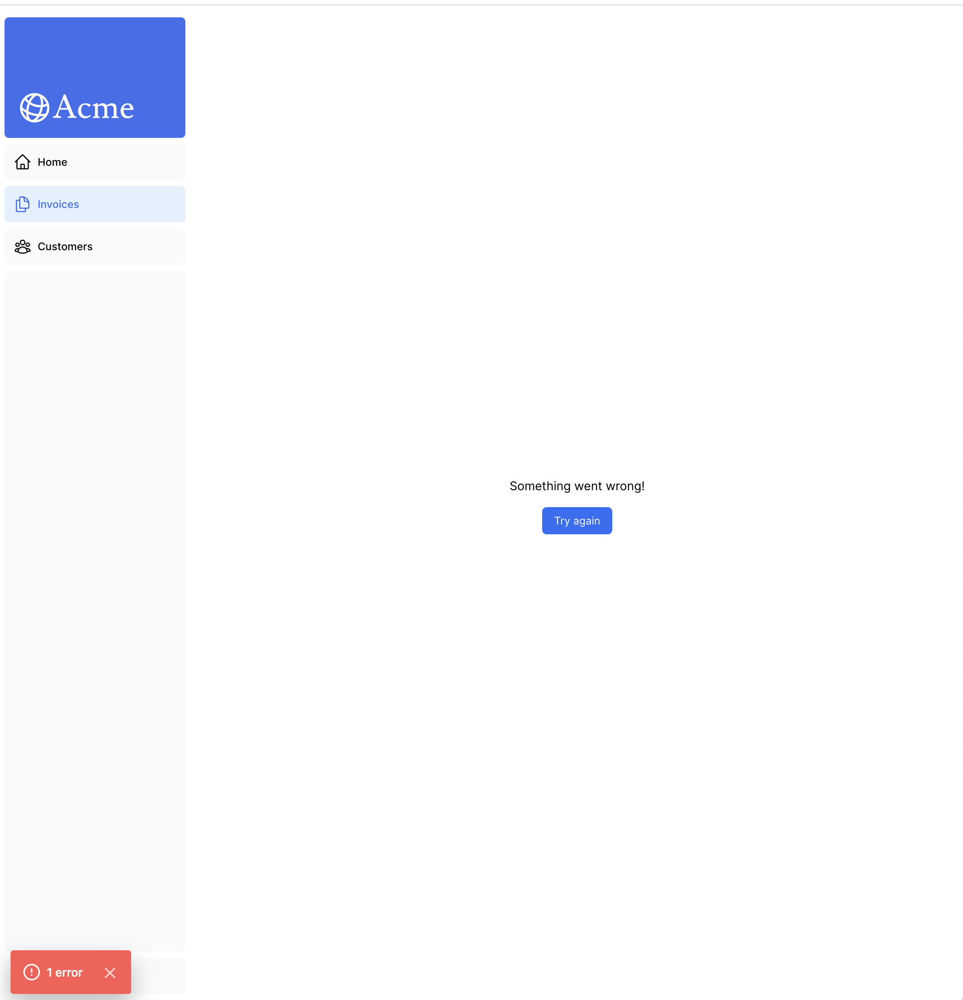
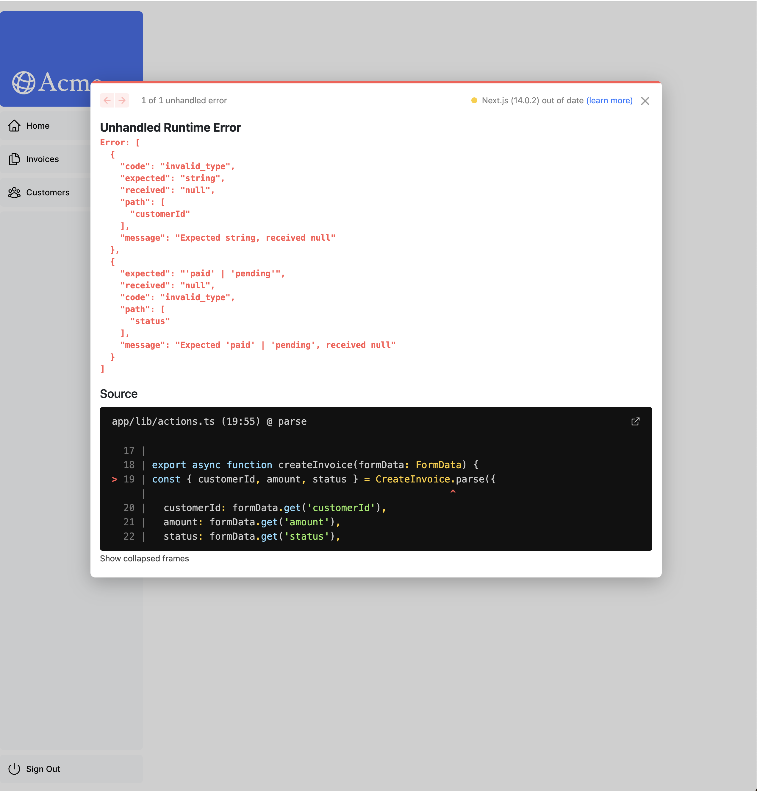
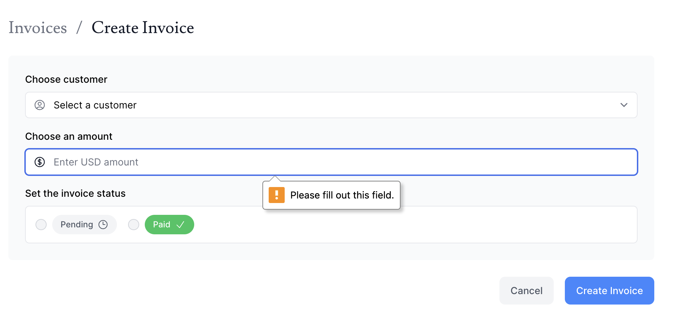
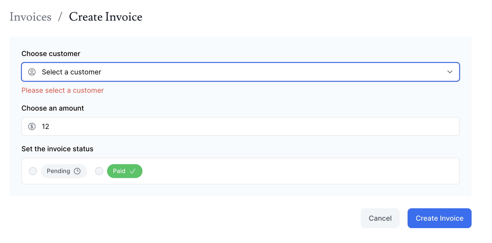

前回は [2024 年のフロントエンド技術学び直し (6)]() にて Next.js のチュートリアルのうち、11 章まで終わりました。本日は 13 章から進めていきます。

## [13. Handling Errors](https://nextjs.org/learn/dashboard-app/error-handling)

前章では、Server Actions を使いデータを変更する方法を学びました。本章では JavaScript の `try/catch` 構文と Next.js API を使ってエラーを適切に処理する方法を学べるようです。

まずは普通に JavaScript の `try/catch` 構文を使い actions.ts を直していきます。これに関しては特段辺なことはありませんでした。次に Next.js に存在する特別なファイルである [`error.tsx`](https://nextjs.org/docs/app/api-reference/file-conventions/error) を使っていきます。

ざっくり、`error.tsx` の特徴としては、

- `"use client"` とあるようにクライアントコンポーネントである。
- 2 つの引数を受け取り、
  - `error` は JavaScript のネイティブ Error オブジェクト
  - `reset` はエラー境界をリセットする関数で実行されるとルートセグメントの再レンダリングを行う。

たしかにこの状態で請求書を削除してみようとすると次のような画面になりました。



### 404 エラーを `notFound` 関数で処理する

`notFound` 関数を用いることでエラーをきれいに取り扱うことができるようです。チュートリアルでは、`page.tsx` の中で呼び出すようにしてみます。
`not-found.tsx` というファイルを追加することで not found と描画されるようになりました。`notFound` 関数は `error.tsx` より優先されるようですね。

追加で `notFound` 以外にも似たような関数、例えば `badRequest` とかは存在するのかなと思い、[Functions](https://nextjs.org/docs/app/api-reference/functions) を調べてみましたがなさそうですね。

## [14. Improving Accessibility](https://nextjs.org/learn/dashboard-app/improving-accessibility)

今度は入力のバリデーションについて Server Actions のサーバーサイドにおける実装方法を学ぶことができるようです。

まずアクセシビリティの ESLint プラグインがすでに Next.js には含まれているので早速リンターを使ってみます。

```console
% npm run lint

> lint
> next lint

✔ No ESLint warnings or errors
```

特にエラーは見つかりませんでした。ここであえてエラーを出すために画像にある `alt` タグを消してやってみます。

```console
% npm run lint

> lint
> next lint


./app/ui/invoices/table.tsx
29:23  Warning: Image elements must have an alt prop, either with meaningful text, or an empty string for decorative images.  jsx-a11y/alt-text

info  - Need to disable some ESLint rules? Learn more here: https://nextjs.org/docs/basic-features/eslint#disabling-rules
```

こんな感じでエラーが検出されるようですね。さらに Vercel にデプロイしてみても警告ログが出ているようです。これは Next.js のビルドプロセスにおいて行われているからなようですね。

さて次にフォームのバリデーションに進みます。何も入力せずに請求情報を作成すると Something went wrong! とでておりさらに左下の赤い部分をクリックすると以下のような画面が出てきます。



必須入力のフィールドが空なのでエラーになっています。さてまずはクライアント側のバリデーションを実装します。ざっくり言えば `required` 要素を追加するという方法です。さっそくやってみると怒られますね。



クライアントサイドのバリデーションではなく次にサーバーサイドのバリデーションの方法について学びます。`useFormState` というフックを使うようです。かなり長く色々な場所をいじくりまわしますがうまく実装できると、顧客を選択していない場合に次のようなエラーになるようです。



いい感じです。あとは練習にあるように他のフィールドについてもエラーメッセージなどを追加していきます。

---

以上です。次からは 15 章に進みます。認証の追加を行うようですね。
