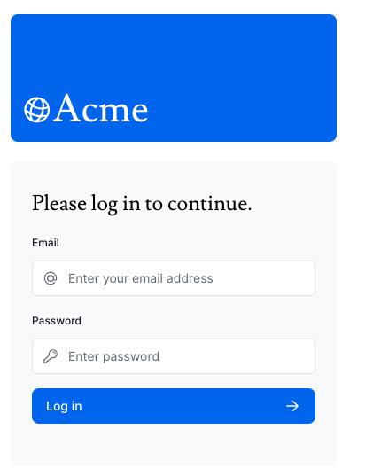
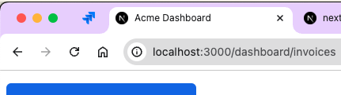
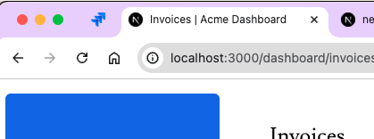

前回は [2024 年のフロントエンド技術学び直し (7)]() にて Next.js のチュートリアルのうち、14 章まで終わりました。本日は 15 章から進めていきます。

## [15. Adding Authentication](https://nextjs.org/learn/dashboard-app/adding-authentication)

この章ではダッシュボードに認証機能を追加していくようです。認証 (Authentication) と認可 (Authorization) の違いについてまず説明があります。

- **認証**とはユーザーが本人であることを確認することで、ユーザー名とパスワードのようなものを用いて自分であることを証明することになる。
- **認可**とは次の段階のことでユーザーの身元が確認できたら次に認可がアプリケーションのどの部分を利用していいか決定する。

さてかなり長いコード編集を進めていくと次のような画面ができました。

とりあえずログインはできました。とはいえあんまり理解は深まってはいません。

## [16. Adding Metadata](https://nextjs.org/learn/dashboard-app/adding-metadata)

メタデータは HTML の `<head>` 要素に含まれるものでユーザーには見えないがサーチエンジン等のシステムにとってそのウェブシステムの内容をよりよく理解するために必要な情報です。
メタデータを追加するためには 2 つの方法があるようです。

- 設定ファイル
- 特別なファイル

`layout.js` や `page.js` にメタデータオブジェクトを含ませることができるようです。チュートリアルのように `app/layout.tsx` にメタデータを追加するとタイトルなどが表示されるようになりました。

ただ特定のページにカスタムタイトルを追加したい場合はどうするのか、という問いに対してはメタデータをそれぞれのところに追加すれば上書きされるとのこと。

---

てなわけで約 1 ヶ月に渡りチュートリアルに取り組んできましたがここで終わりました。少しは Next.js の仕組みについて理解できたかと思います。
この次にフロントエンドを学習するためにはどうすればいいでしょうか。一旦考えてみます。
