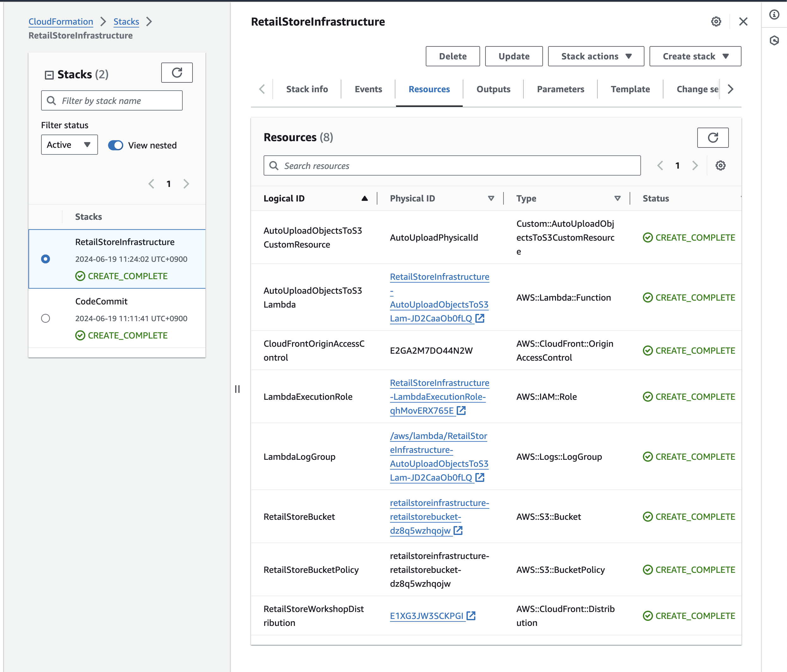
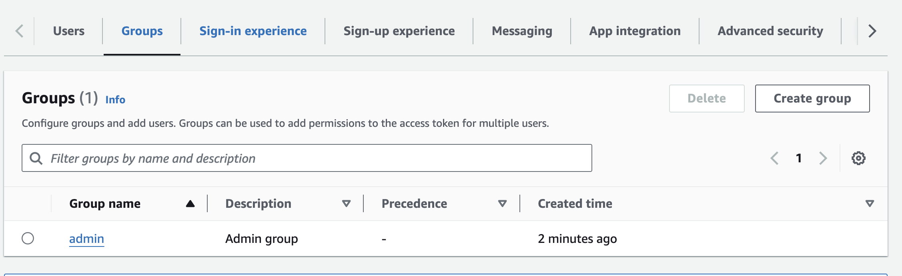
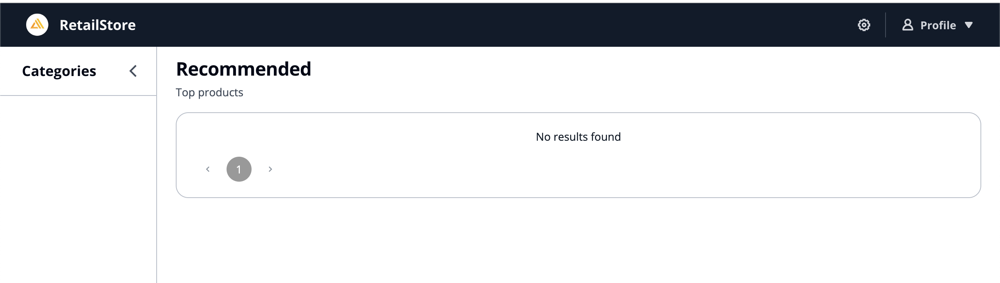
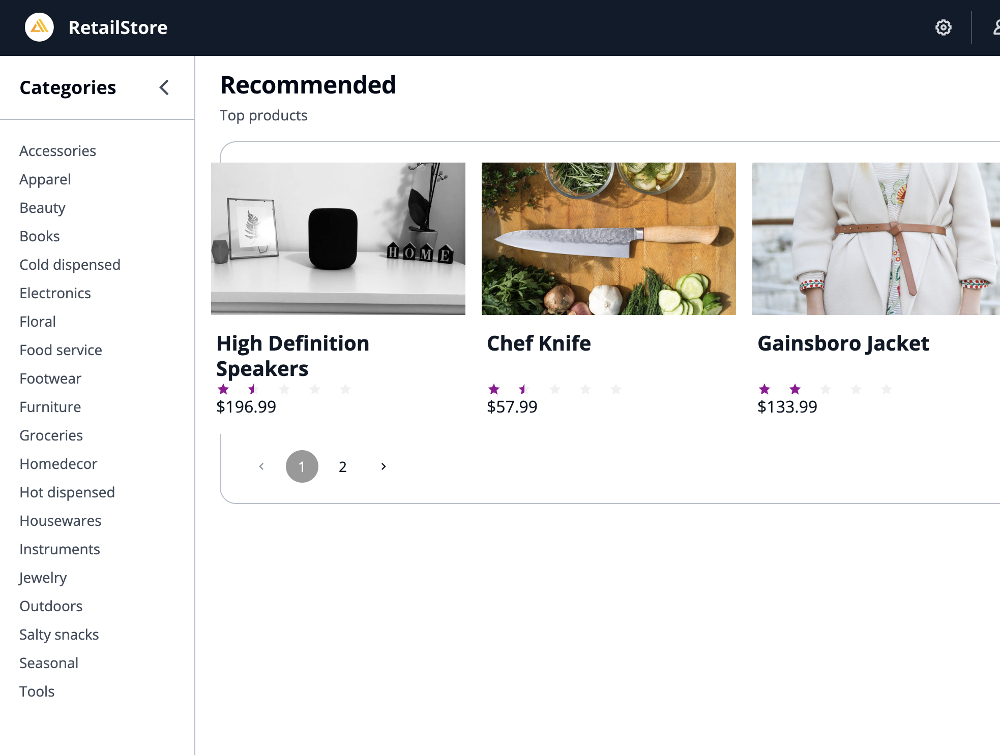
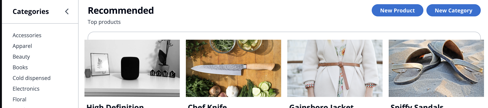
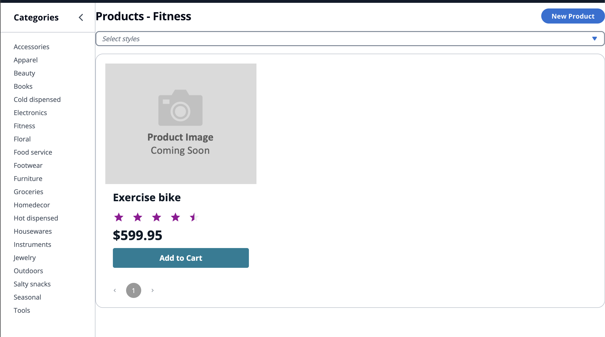

ここ最近ずっと Next.js のチュートリアルに取り組んでいましたが一旦終わったので次なる学習として、AWS ワークショップシリーズから、[AWS Amplify Gen2 を使ったウェブアプリケーション構築の学び方](https://aws.amazon.com/jp/builders-flash/202402/amplify-gen2-workshop/) を進めていきます。実は前職で Amplify は少し使っていたのですが当時はフロントエンドを敬遠していたので全く触らずに退職してしまいました。今回は Gen2 になった Amplify についてワークショップで学びながら理解を深めていきたいと思います。

# はじめに

[Getting Started](https://catalog.workshops.aws/amplify-core/en-US/02-getting-started) から取り組んでいきます。まずはじめに RetailStore という仮想の EC サイトを作成していくようです。


上記の画像はワークショップのサイトから引用しています。アーキテクチャを見る限りは、データベースは Amazon DynamoDB を採用しており、GraphQL を使ってクライアントとやり取りをするようですね。

## AWS アカウントと Amplify のセットアップ

今回は自分の AWS アカウントを使って進めていくので [Using Your Own AWS Account](https://catalog.workshops.aws/amplify-core/en-US/02-getting-started/02-own-account) の指示に従い進めていきます。

うまく進むかなーと思いましたがセットアップ途中で詰まりました。

```console
branch 'main' set up to track 'origin/main'.
Starting VSCode code-server CloudFormation stack

Error parsing parameter '--template-body': Unable to load paramfile file://own-account-static-assets.yaml: [Errno 2] No such file or directory: 'own-account-static-assets.yaml'
Waiting for VSCode stack to complete. Can take around 15 minutes, polling every 30 seconds

Waiter StackCreateComplete failed: Waiter encountered a terminal failure state: Matched expected service error code: ValidationError
VSCode stack complete


Setup is complete
```

うまく動かなかったので少し直してスタックを再度作成しました。

```console
% aws cloudformation create-stack \
  --stack-name RetailStoreInfrastructure \
  --template-body file://static-assets.yaml \
  --capabilities CAPABILITY_NAMED_IAM \
  --disable-rollback \
  --parameters \
      ParameterKey=S3ImageAssetBucket,ParameterValue=amplify-workshop-gsildmtc4v \
      ParameterKey=S3ImageAssetKey,ParameterValue=images.zip
```

上記のコマンドで直したところは `--template-body` のパラメータに渡すファイル名と `--parameters` にある `S3ImageAssetBucket` の値です。S3 バケット名は `amplify-workshop-` から始まるバケット名なので自分の場所で作成されたバケット名に変更すればリソースが生成されるようになりました。

少し待っていると 2 つのスタックができていました。



次に CodeCommit にあるコードをローカルに取得します。[`git-remote-codecommit`](https://github.com/aws/git-remote-codecommit) なるツールをインストールしごにょごにょすればひとまずクローンできました。

依存関係のインストールなどを進めていきます。ひとまずローカル環境では、Node.js 20.14.0 を利用していきます。

[Setup Amplofy](https://catalog.workshops.aws/amplify-core/en-US/11-starting-amplify/02-setup-amplify) の章を進めていくと Amplify CLI を導入する部分がありますがその時点では以下のようになりました。

```console
% git status -s
M  .gitignore
A  amplify/auth/resource.ts
A  amplify/backend.ts
A  amplify/data/resource.ts
A  amplify/package.json
A  amplify/tsconfig.json
M  package-lock.json
M  package.json
```

続いて、案内に従い CDK を導入していきます。

```console
% npx cdk bootstrap aws://******/us-west-2
 ⏳  Bootstrapping environment aws://********/us-west-2...
Trusted accounts for deployment: (none)
Trusted accounts for lookup: (none)
Using default execution policy of 'arn:aws:iam::aws:policy/AdministratorAccess'. Pass '--cloudformation-execution-policies' to customize.
CDKToolkit: creating CloudFormation changeset...
 ✅  Environment aws://*********/us-west-2 bootstrapped.
```

続いて Amplify Sandbox を作成します。この環境はバックエンドをテストするためのエフェメラル環境ということで変更を検知してずっとデプロイしてくれると書かれています。なのでこの辺の画面まで来たらあとは放置でよいようです。

## 閑話休題: [A Code First Approach](https://catalog.workshops.aws/amplify-core/en-US/11-starting-amplify/03-code-first)

ここは何かワークショップで手を動かすことはないですが、Amplify についての説明が書かれています。ざっくりまとめてみると、

- 全てのスタックにおいて TypeScript で表現される。
  - Infrastructure-from-code paradigm (IfC)
- Gen2 ではディレクトリごとに異なる役割を記述する。
  - `amplify/` 以下はバックエンドの設定。
  - `app/` 以下は今まで通り既存のフロントエンドの設定
- 開発者ごとにクラウドのサンドボックス環境を用意する
- Git ベースな環境
  - ブランチごとに AWS 環境を変更できる
- CDK との統合によりシームレスに他の AWS サービスを利用できる

このような特徴があるようです。

# Amplify に触ってみる

やっとこさ AWS Amplify をバックエンドとしてアプリケーションの構築を進めていきます。

## データモデルの構築

今回の RetailStore というアプリケーションでは Product と Category という 2 つのモデルがあります。この章で定義したデータモデルは AWS AppSync を用いた GraphQL API に対応し、Amazon DynamoDB をデータストアとして利用するようになります。

まずはじめに `amplify/data/resource.ts` を開きチュートリアルにあるようにコードを書きます。
ここでは割とわかりやすくデータモデルの定義を書くことができました。
またデータモデル間のリレーションも定義できるようです。例えば Category は Product と 1 対多の関係を持っていることが推察できます。それを `hasMany()` や `belongsTo()` という関数で定義できるようです。

## 認証認可の追加 {id=add_authorization_and_authentication}

Amazon Cognito と統合されているのでそれを用いて認証と認可を追加していきます。まずは `amplify/auth/resource.ts` を開いてみると E メールでログインするようになっています。チュートリアルでは Admin というグループを作成していきます。

`amplify/backend.ts` を編集することにより、Amazon Cognito のユーザープールに Admin グループを示すものを作成してくれるようです。確かに `npx ampx sandbox` の画面では何か作られているように見えます。

```console
⚠️  The following non-hotswappable changes were found:
    logicalID: AuthGroupStack7BF2A8DD, type: AWS::CloudFormation::Stack, reason: resource 'AuthGroupStack7BF2A8DD' was created by this deployment

Could not perform a hotswap deployment, as the stack amplify-retailstore-ryosan470-sandbox-9eb810ad87 contains non-Asset changes
Falling back to doing a full deployment
amplify-retailstore-ryosan470-sandbox-9eb810ad87: updating stack...
amplify-retailstore-ryosan470-sandbox-9eb810ad87-data7552DF31-QI3OX0NYA7B9 |   0 | 12:37:52 PM | UPDATE_IN_PROGRESS   | AWS::CloudFormation::Stack | amplify-retailstore-ryosan470-sandbox-9eb810ad87-data7552DF31-QI3OX0NYA7B9 User Initiated
amplify-retailstore-ryosan470-sandbox-9eb810ad87-AuthGroupStack7BF2A8DD-16RPPHN2YMO71 |   0 | 12:37:52 PM | CREATE_IN_PROGRESS   | AWS::CloudFormation::Stack | amplify-retailstore-ryosan470-sandbox-9eb810ad87-AuthGroupStack7BF2A8DD-16RPPHN2YMO71 User Initiated
amplify-retailstore-ryosan470-sandbox-9eb810ad87 |   0 | 12:37:52 PM | CREATE_IN_PROGRESS   | AWS::CloudFormation::Stack | AuthGroupStack.NestedStack/AuthGroupStack.NestedStackResource (AuthGroupStack7BF2A8DD) Resource creation Initiated
amplify-retailstore-ryosan470-sandbox-9eb810ad87 |   0 | 12:37:47 PM | UPDATE_IN_PROGRESS   | AWS::CloudFormation::Stack | amplify-retailstore-ryosan470-sandbox-9eb810ad87 User Initiated
amplify-retailstore-ryosan470-sandbox-9eb810ad87 |   0 | 12:37:50 PM | UPDATE_IN_PROGRESS   | AWS::CloudFormation::Stack | auth.NestedStack/auth.NestedStackResource (auth179371D7)
amplify-retailstore-ryosan470-sandbox-9eb810ad87 |   1 | 12:37:51 PM | UPDATE_COMPLETE      | AWS::CloudFormation::Stack | auth.NestedStack/auth.NestedStackResource (auth179371D7)
amplify-retailstore-ryosan470-sandbox-9eb810ad87 |   1 | 12:37:51 PM | CREATE_IN_PROGRESS   | AWS::CloudFormation::Stack | AuthGroupStack.NestedStack/AuthGroupStack.NestedStackResource (AuthGroupStack7BF2A8DD)
amplify-retailstore-ryosan470-sandbox-9eb810ad87 |   1 | 12:37:52 PM | UPDATE_IN_PROGRESS   | AWS::CloudFormation::Stack | data.NestedStack/data.NestedStackResource (data7552DF31)
amplify-retailstore-ryosan470-sandbox-9eb810ad87 |   2 | 12:38:14 PM | UPDATE_COMPLETE      | AWS::CloudFormation::Stack | data.NestedStack/data.NestedStackResource (data7552DF31)
amplify-retailstore-ryosan470-sandbox-9eb810ad87 |   3 | 12:38:26 PM | CREATE_COMPLETE      | AWS::CloudFormation::Stack | AuthGroupStack.NestedStack/AuthGroupStack.NestedStackResource (AuthGroupStack7BF2A8DD)
amplify-retailstore-ryosan470-sandbox-9eb810ad87 |   4 | 12:38:27 PM | UPDATE_COMPLETE_CLEA | AWS::CloudFormation::Stack | amplify-retailstore-ryosan470-sandbox-9eb810ad87
amplify-retailstore-ryosan470-sandbox-9eb810ad87 |   3 | 12:38:39 PM | UPDATE_COMPLETE      | AWS::CloudFormation::Stack | data.NestedStack/data.NestedStackResource (data7552DF31)
amplify-retailstore-ryosan470-sandbox-9eb810ad87 |   2 | 12:38:39 PM | UPDATE_COMPLETE      | AWS::CloudFormation::Stack | auth.NestedStack/auth.NestedStackResource (auth179371D7)
amplify-retailstore-ryosan470-sandbox-9eb810ad87 |   3 | 12:38:39 PM | UPDATE_COMPLETE      | AWS::CloudFormation::Stack | amplify-retailstore-ryosan470-sandbox-9eb810ad87

 ✅  amplify-retailstore-ryosan470-sandbox-9eb810ad87

✨  Deployment time: 62.91s
```

さらに Cognito のコンソールで確認してみると確かに `admin` というグループが作成されています。



次に先ほど定義したデータスキーマにアクセス制御を設定します。これにより、

- 未認証ユーザーは Product と Category に対して読み取り権限のみ付与される。
- Product に関して所有者に権限を付与したので所有者は全ての権限を持っている。
- `admin` グループに所属しているユーザーは各々のモデルに対して全ての権限を持っている。

という定義になるようです。少し待っていると、Sandbox 環境が AWS 側に出来上がります。

```console
[Sandbox] Watching for file changes...
File written: amplify_outputs.json
```

そうしたら指示に従い `admin` ユーザーを作成していきます。うまくいけば `no-reploy@verificationemail.com` より臨時パスワードが届くようです。

## フォームの作成

Amplify には React コードのフォーム生成という機能があるようです。データモデルに紐づく作成と更新のフォームを自動的に生成してくれると書かれています。早速試してみます。

早速指示されたコマンドを入力してみるといくつかのファイルが生成されました。

```console
% tree graphql ui-components
graphql
├── API.ts
├── mutations.ts
├── queries.ts
└── subscriptions.ts
ui-components
├── CategoryCreateForm.d.ts
├── CategoryCreateForm.jsx
├── CategoryUpdateForm.d.ts
├── CategoryUpdateForm.jsx
├── graphql
│   ├── mutations.ts
│   ├── queries.ts
│   └── subscriptions.ts
├── index.js
└── utils.js

3 directories, 13 files
```

同じように Product のフォームも生成します。

ここまででひとまず RetailStore というアプリケーションのバックエンドに関しては完了したようです。次の章から Next.js のアプリケーションを改修していきます。

# [Next.js アプリケーションのカスタマイズ](https://catalog.workshops.aws/amplify-core/en-US/13-customize-client)

RetailStore というアプリケーションに早速サインインとサインアップを追加していきます。AWS Amplify ライブラリには _Authenticator_ というコンポーネントがありログインなどの体験をさっくり導入できるようです。

ローカルで確認できるようなので確認してみようとしましたが真っ白です。`src/App.tsx` を少しだけ修正します。

```javascript
function App() {
  const baseURL = process.env.NODE_ENV === "development" ? `/RetailStore` : "";

  return (
    <ThemeProvider>
      <Authenticator.Provider>
```

`baseURL` の部分を修正してから、http://localhost:8081/RetailStore に接続すれば以下のようなウェブサイトが表示されます。



[認証認可の追加](#add_authorization_and_authentication) で作成したアカウントでログインできました。

次にサンプルデータをロードします。CloudFront の URL に関しては CloudFormation のスタックのアウトプットをコピーしました。そしてサンプルデータを読み込みます。



うまく読み込めればこのような形で、カテゴリと商品が表示されるようになります。

> 私は `backend.ts` の中で管理者グループの名前を `admin` で作ってしまったので `amplify/data/resource.ts` も修正する必要がありました。

続いて、フォームビルダーによって自動生成されているフォームコンポーネントを利用していきます。チュートリアルに従いコードをコピペなどをしていきます。

> 管理者グループの名前を `admin` で作ってしまったので `setIsAdmin(user.tokens.accessToken.payload["cognito:groups"].includes('admin'));` のような修正が必要でした。

うまくできていれば、トップページの右上あたりに New Category というボタンが表示されます。



指示に従いカテゴリーと商品の追加をすると最終的に次のようになりました。


