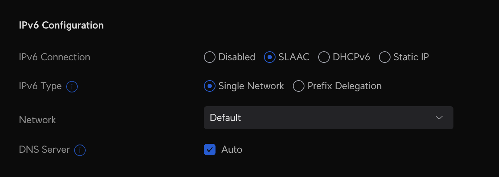
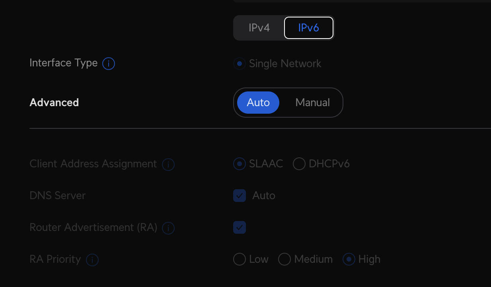
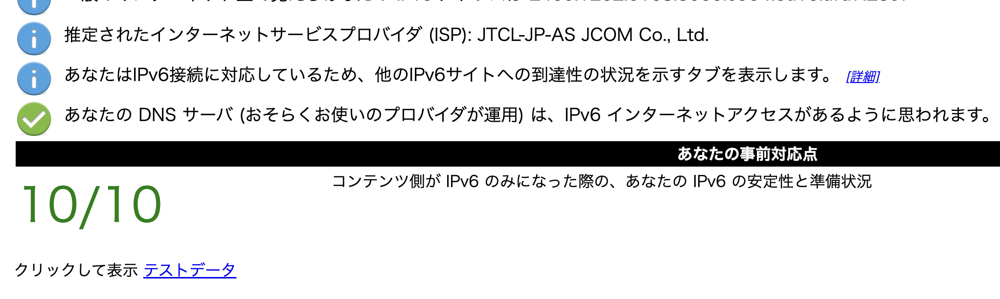

我が家にはルーターとして [Unifi Dream Router](https://jp.store.ui.com/products/dream-router) (以下、UDR) があります。このルーターの配下にいるクライアントPCやスマートフォンにIPv6アドレスをふるのに苦労したのでどう設定したかを記載します。

# 前提

- 我が家のISPは、JCOMです。
    - JCOM は IPv6 アドレスを利用できます。
        - https://cs.myjcom.jp/knowledgeDetail?an=000477768
    - なのでよくある NTT 網のように IPoE などの話とは異なり、IPv6 接続を可能にしたところで通信速度が高速になったり... という話はありません。
- KAONという貸与された謎のモデムが Wifi を吹いていてその配下に UDR がおかれています。

# 設定

早速どのように設定したかを記載します。

まず、インターネット接続の設定の IPv6 Configuration を設定します。このとき、IPv6 Connection を SLAAC にします。

つづいてネットワークに移動し、自身の宅内ネットワークを選択します。ここの IPv6 に関しては私の環境では Auto で普通に繋がります。

こうすることでついに IPv6 アドレスを UDR 配下のクライアントに配信できます。

# 確認

私は手っ取り早く以下のサイトで確認しました。

https://test-ipv6.com/index.html.ja_JP

普通に繋がっていれば以下のような形になるかと思います。

または、ブラウザから https://ipv6.google.com に接続できれば、IPv6ネットワークに接続できていることを確認できます。

# まとめ

これで自宅からもIPv6環境に繋がるようになりました。みなさんもよき、IPv6ネットワークを楽しんでください。
